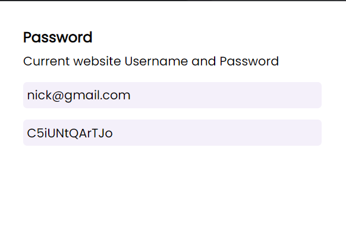
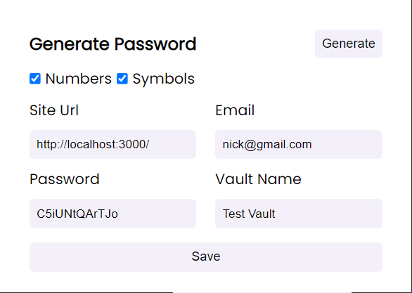

#  EPass Extension

## Project Overview

Epass extension is part of EPass (Password Manager) where users can view their passwords for each. They can generate password with numbers and string for each website. The passwords which are created are in sync with the backend so that users can also view their password in Credentials section of EPass.

<p align="left">



</p>

## Features

- Users are can view current website password
- They can generate password with numbers and strings or both.

## Install

Since this project is not published to chrome store. You can follow these steps to install it.

Step 1: Clone the repo

```
git clone https://github.com/LUCIFER-dev-king/password-manager-extension.git
```

Step 2: Build the project

```
cd password-manager-extension && npm run build
```

Step 3: Got to Chrome extenstion tab `chrome://extensions/` and Click load unpacked and select the build folder.

## Devloped and Maintained By

📸 [Instagram](https://www.instagram.com/lucifer_the_king/?hl=en) <br />
🧳 [LinkedIn](https://www.linkedin.com/in/nihal-ahamed-m-s-7b6808190/)
<br>

**MADE WITH 💖, HAPPY CODING!**
